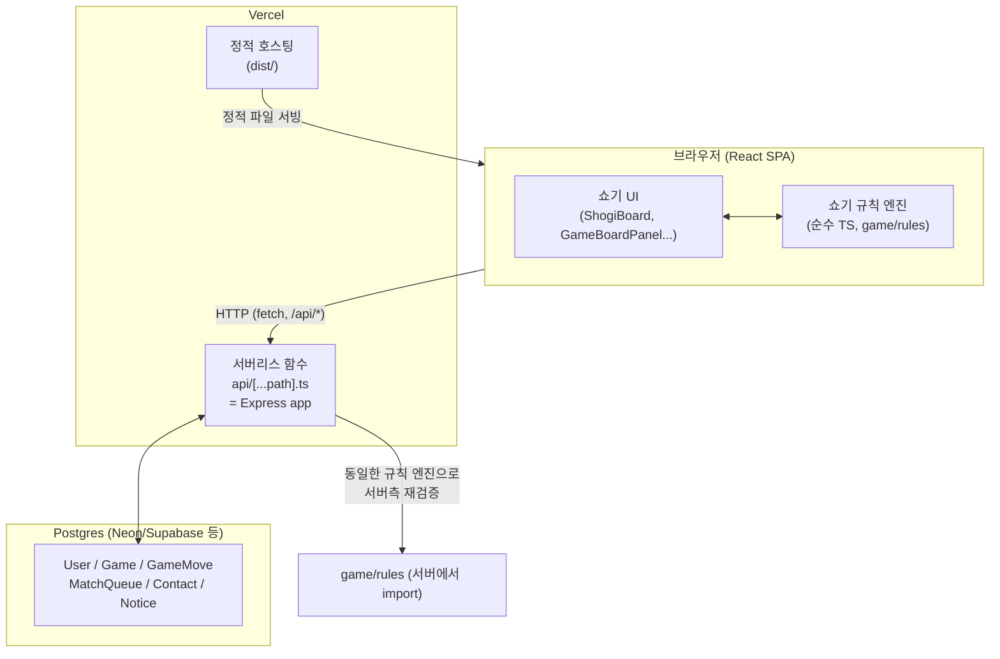
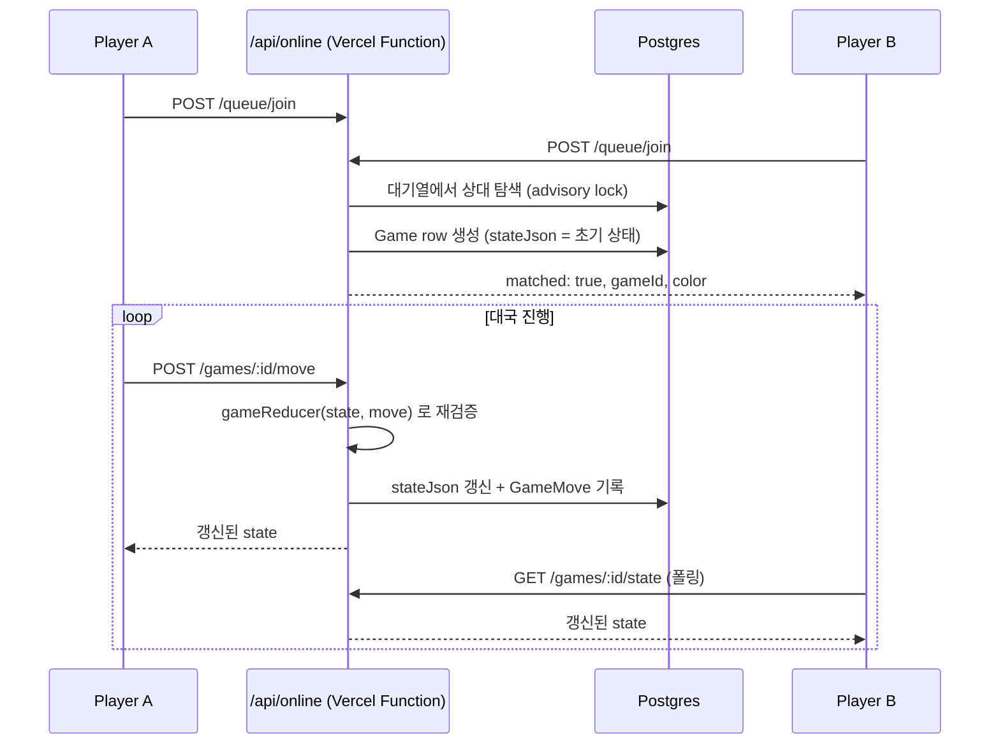
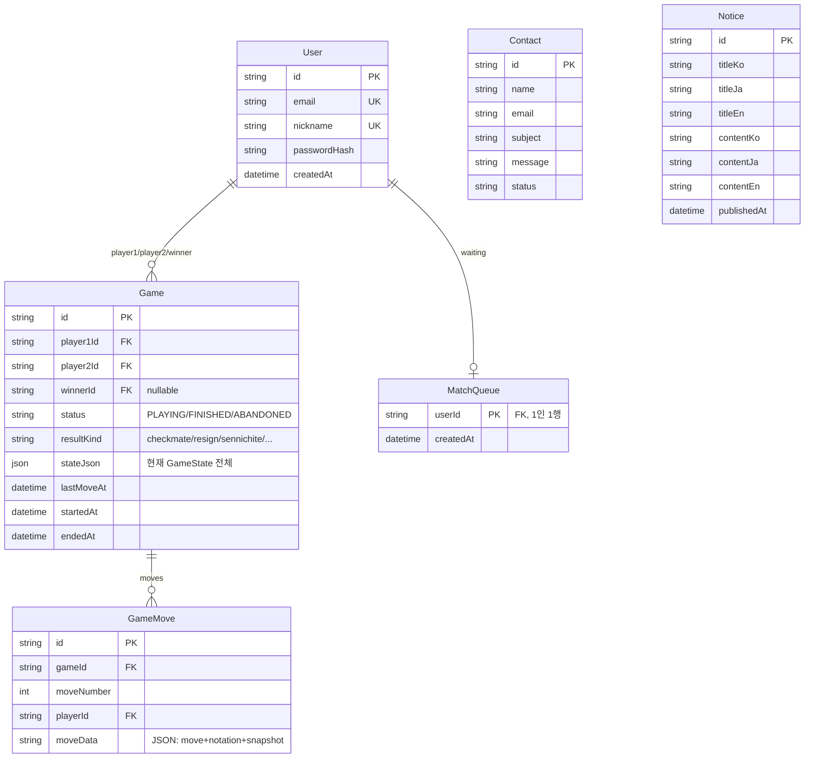

# 将棋道場 (Shogi Dojo)

일본 전통 보드게임 쇼기(将棋)를 처음 접하는 사람도 규칙을 배우고, 연습하고, 컴퓨터·온라인 대전을 하고, 자신의 대국을 복기할 수 있는 3개 국어(한국어/日本語/English) 웹 서비스

[Demo](#) · [GitHub](#) · [배포 가이드](./DEPLOY.md)

---

## 📌 프로젝트 소개

체스나 장기와 달리 **잡은 기물을 자신의 것으로 다시 사용(持ち駒)**할 수 있다는 독특한 규칙을 가진 쇼기는, 규칙 자체가 낯설어 진입 장벽이 높은 게임입니다. 이 프로젝트는

> **쇼기를 처음 본 사람이 규칙을 배우고 → 연습하고 → 컴퓨터와 대전하고 → 온라인으로 다른 사용자와 대전하고 → 자신의 대국을 복기하는 것**

까지 하나의 흐름으로 경험할 수 있는 웹 서비스를 목표로 만들었습니다.

시각적으로는 **1990년대 일본 개인 홈페이지 + 전통 쇼기 도장(将棋道場)**의 분위기(목재색 배경, 종이 질감, 명조×고딕 타이포, 얇은 구분선)를 지향하지만, 실제 조작감은 현대적인 웹 앱 수준을 유지하는 것을 디자인 원칙으로 삼았습니다.

가장 신경 쓴 부분은 **쇼기 규칙 엔진의 정확성**입니다. 성(成り), 持ち駒, 二歩, 打ち歩詰め, 체크/체크메이트, 千日手(반복수 무승부), 連続王手의 千日手(반칙패)까지 공식 규칙대로 구현하고 73개의 유닛 테스트로 검증했으며, 이 엔진은 로컬 CPU 대전·온라인 대전(서버)·튜토리얼·기보 불러오기에서 **모두 동일한 코드**로 재사용됩니다.

## ✨ 주요 기능

| 영역 | 내용 |
|---|---|
| **쇼기 규칙 엔진** | 8종 기물 + 6종 성駒, 이동/성/持ち駒/드롭 규칙, 왕수·체크메이트 판정, 千日手·連続王手 판정을 순수 TypeScript로 구현 |
| **학습(はじめての将棋)** | 6단계 인터랙티브 프롤로그, 기물 사전(이동 범위 시각화), 실제 게임 엔진으로 진행되는 가이드형 튜토리얼 대국 |
| **컴퓨터 대전** | 5단계 난이도(아주 쉬움~매우 어려움). 랜덤 합법수(최하) ~ 미니맥스+알파베타+iterative deepening(최상) |
| **온라인 대전** | 회원 간 실시간(폴링 기반) 대전. 모든 수는 서버가 동일한 규칙 엔진으로 재검증 — 클라이언트를 신뢰하지 않음. 재접속·시간패 청구 지원 |
| **기보/복기** | 대국 자동 기록(棋譜), 처음/이전/다음/자동재생/배속 조절, KIF 파일 불러오기(Shift-JIS 자동 감지) |
| **회원 시스템** | 이메일/비밀번호 회원가입·로그인, JWT 기반 세션 유지(새로고침해도 유지) |
| **공지사항/문의하기** | DB 연동, 다국어 공지 본문, 문의 폼 서버 검증 |
| **다국어** | 한국어/日本語/English 전체 UI, `t("key")` 기반 i18n(하드코딩 문자열 없음) |
| **반응형 레트로 UI** | 데스크톱은 고정폭 레트로 레이아웃, 모바일은 현대적 반응형으로 자연 전환 |

## 🖥️ 화면

> 스크린샷은 추후 추가 예정입니다. 주요 화면은 다음과 같습니다.

| 페이지 | 경로 |
|---|---|
| 홈 | `/` |
| 쇼기 배우기(프롤로그·기물 사전) | `/learn` |
| 튜토리얼 대국 | `/learn/tutorial` |
| 컴퓨터 대전 | `/play/cpu` |
| 온라인 대전 | `/play/online` |
| 기보 복기 | `/replay/:id` |
| 기보(KIF) 불러오기 | `/kifu` |
| 도장(전적/프로필) | `/profile` |

## 🛠️ 기술 스택

**Frontend**
- React 19, TypeScript, Vite
- React Router 7 (SPA 라우팅)
- CSS Modules (디자인 시스템 토큰 기반 커스텀 스타일, UI 라이브러리 미사용)
- Vitest (유닛 테스트)

**Backend**
- Node.js, Express
- Prisma ORM + PostgreSQL
- JWT(jsonwebtoken) + bcryptjs (인증)
- Zod (요청 검증)

**Infra / Dev**
- Docker (로컬 개발용 Postgres)
- Vercel (프론트엔드 정적 호스팅 + 백엔드 서버리스 함수)
- tsx (TypeScript 백엔드 실행)

## 🏗️ 시스템 아키텍처



**온라인 대전은 WebSocket이 아니라 HTTP 폴링으로 동작합니다.** Vercel 서버리스 함수는 요청마다 실행되고 종료되는 구조라 지속적인 소켓 연결이나 인메모리 상태(대기열, 대국방)를 유지할 수 없기 때문입니다. 그래서 매칭·수·대국 상태를 전부 Postgres에 저장하고, 두 클라이언트는 같은 대국 row를 각자 폴링(약 0.9~1.2초 간격)해서 "대화"합니다. 이 구조 덕분에 새로고침해도 `localStorage`에 저장된 대국 ID로 그대로 이어지는 재접속이 자연스럽게 구현됩니다.



## 📂 프로젝트 구조

```text
.
├── src/                        # 프론트엔드 (Vite + React)
│   ├── api/                    # REST API 클라이언트 (fetch 래퍼)
│   ├── auth/                   # AuthContext, 토큰 저장
│   ├── components/
│   │   ├── common/              # RetroButton, RetroPanel, RetroHeader, RetroDialog...
│   │   ├── shogi/                # ShogiBoard, ShogiPiece, CapturedPieces, MoveHistory...
│   │   ├── game/                 # GameBoardPanel, ResultModal, DifficultySelect...
│   │   └── learning/              # PieceMoveDemo, PromotionDemo, DropDemo
│   ├── game/                    # 쇼기 규칙 엔진 — 프레임워크 독립적 순수 TypeScript
│   │   ├── types/                 # 도메인 타입 (Board, Piece, Move, GameState...)
│   │   ├── rules/                  # pieceMovement / promotion / drops / check / checkmate / repetition / legalMoves
│   │   ├── state/                   # gameState(초기화), gameReducer, tutorialState
│   │   ├── notation/                 # kifu.ts(기보 표기 생성), kifParser.ts(KIF 불러오기)
│   │   ├── ai/                        # cpuPlayer, minimax, evaluate
│   │   ├── storage/                    # localStorage 기반 로컬 대국 기록
│   │   └── __tests__/                   # 73개 유닛 테스트
│   ├── hooks/                    # useShogiGame / useOnlineShogiGame / useReplayPlayer
│   ├── i18n/                     # ko.json / ja.json / en.json + I18nContext
│   └── pages/                    # 라우트별 페이지 컴포넌트
├── server/                      # 백엔드 (Express + Prisma)
│   ├── prisma/                   # schema.prisma, migrations/
│   └── src/
│       ├── app.ts                  # Express 앱 정의 (로컬/Vercel 공용)
│       ├── index.ts                 # 로컬 개발 진입점 (app.listen)
│       ├── auth/                     # 회원가입 / 로그인 / JWT 미들웨어
│       ├── contact/                   # 문의하기 API
│       ├── notice/                     # 공지사항 API
│       ├── games/                       # 대국 기록 조회 API
│       └── online/                       # 온라인 대전 폴링 API (매칭/수/투료/시간패)
├── api/
│   └── [...path].ts              # Vercel 서버리스 진입점 (server/src/app.ts를 그대로 감쌈)
├── vercel.json                  # 빌드/설치 커맨드, SPA 라우팅 rewrite
└── DEPLOY.md                    # Vercel 배포 가이드
```

## 🗄️ ERD



## 📡 API

모든 응답은 JSON. 인증이 필요한 엔드포인트는 `Authorization: Bearer <JWT>` 헤더 필요.

| Method | Endpoint | 설명 | 인증 |
|---|---|---|---|
| POST | `/api/auth/register` | 회원가입 (이메일/비밀번호/닉네임 검증, 닉네임 중복 확인) | - |
| POST | `/api/auth/login` | 로그인 → JWT 발급 | - |
| POST | `/api/auth/logout` | 로그아웃(클라이언트 토큰 폐기) | ✔ |
| GET | `/api/auth/me` | 현재 로그인 사용자 조회 (새로고침 시 세션 복원) | ✔ |
| POST | `/api/contact` | 문의 등록 | - |
| GET | `/api/notices` | 공지사항 목록 | - |
| GET | `/api/notices/:id` | 공지사항 상세 | - |
| GET | `/api/games/mine` | 내 대국 목록 | ✔ |
| GET | `/api/games/:id` | 대국 상세 + 전체 기보(본인 참가 대국만) | ✔ |
| POST | `/api/online/queue/join` | 매칭 대기열 참가 (상대 있으면 즉시 매칭) | ✔ |
| POST | `/api/online/queue/leave` | 매칭 취소 | ✔ |
| GET | `/api/online/queue/status` | 매칭 상태 폴링 | ✔ |
| GET | `/api/online/games/:id/state` | 대국 상태 폴링 | ✔ |
| POST | `/api/online/games/:id/move` | 수 제출 (서버가 규칙 엔진으로 재검증) | ✔ |
| POST | `/api/online/games/:id/resign` | 투료 | ✔ |
| POST | `/api/online/games/:id/claim-timeout` | 상대 무응답 시 승리 청구(90초 경과 후) | ✔ |

## 🔐 인증 및 보안

- 비밀번호는 **bcryptjs**로 해시하여 저장 (평문 저장 없음)
- **JWT**(30일 만료) 기반 stateless 인증 — 서버에 세션을 저장하지 않음
- 회원가입/문의하기 등 모든 입력은 **Zod**로 서버측에서 재검증 (클라이언트 검증을 신뢰하지 않음)
- **대국 접근 제어**: `/api/games/:id`, `/api/online/games/:id/*`는 해당 대국의 참가자(player1/player2)만 열람·조작 가능 — 다른 사용자의 대국 ID를 추측해 접근하는 것을 서버에서 차단
- **온라인 대전 수 검증**: 클라이언트가 보낸 수를 그대로 신뢰하지 않고, 서버가 동일한 `gameReducer`로 직접 재계산한 뒤 결과가 실제로 바뀌었을 때만(=합법수일 때만) 반영. raw WebSocket/HTTP로 UI를 우회해 불법수·순서 위반 수를 직접 보내는 시나리오까지 테스트해서 서버가 정상적으로 거부하는 것을 확인함
- 매칭 시 동시 참가 레이스 컨디션 방지를 위해 Postgres advisory lock(`pg_advisory_xact_lock`) 사용

## 💡 주요 기술적 의사결정

**1. 게임 규칙 엔진을 프레임워크와 완전히 분리하고, 클라이언트·서버가 동일 코드를 공유**
`src/game/`은 React/Express 어디에도 의존하지 않는 순수 TypeScript입니다. 이 덕분에 로컬 CPU 대전, 튜토리얼, 기보 불러오기(클라이언트)와 온라인 대전 검증(서버, `server/src/online/routes.ts`가 `../../../src/game/state/gameReducer.js`를 직접 import)이 **같은 로직**을 씁니다. 규칙을 두 번 구현하면서 서로 어긋날 위험 자체를 없앤 설계입니다.

**2. `ShogiGameController` 인터페이스로 UI와 "게임이 어디서 오는가"를 분리**
`useShogiGame`(로컬)과 `useOnlineShogiGame`(온라인)은 서로 다르게 구현되어 있지만 동일한 인터페이스(`selected`, `legalTargets`, `selectSquare`, `resolvePromotion`...)를 반환합니다. `GameBoardPanel` 컴포넌트는 이 인터페이스만 알기 때문에, CPU 대전 화면과 온라인 대전 화면이 보드 UI 코드를 100% 재사용합니다.

**3. 온라인 대전: WebSocket → HTTP 폴링으로 재설계**
처음에는 `ws` 기반 WebSocket 서버(인메모리 대기열/대국방)로 구현했지만, Vercel 서버리스 배포가 목표가 되면서 지속적 연결과 인메모리 상태를 모두 포기해야 한다는 걸 확인하고 전면 재설계했습니다. 모든 상태를 Postgres의 `Game.stateJson`에 저장하고 폴링으로 동기화하는 방식으로 바꿔, 서드파티 실시간 서비스(Pusher 등) 계정 없이도 완전히 서버리스 호환되게 만들었습니다. 대신 재접속이 자연스러워지는 부수 이득이 있었습니다 (연결이 원래 없으니 "끊길" 것도 없음 — `localStorage`에 대국 ID만 있으면 즉시 재개).

**4. SQLite → PostgreSQL 전환**
로컬 개발은 파일 기반 SQLite로 시작했지만, Vercel 서버리스 함수의 파일시스템이 요청 간에 유지되지 않아 배포 시 매 요청마다 DB가 초기화되는 문제가 있어 매니지드 Postgres로 전환했습니다.

**5. CPU 엔진: 고정 depth 대신 시간예산 기반 iterative deepening**
쇼기는 持ち駒(드롭) 때문에 체스보다 분기 계수가 훨씬 큽니다. 고정 depth로는 국면에 따라 계산 시간이 크게 들쭉날쭉해질 위험이 있어, "몇 수 앞까지 본다" 대신 "몇 ms 동안 최대한 본다"로 설계해 난이도별 응답성을 예측 가능하게 만들었습니다.

## 🐛 트러블슈팅

**千日手 판정 테스트가 계속 실패한 문제**
반복수 4회를 정확히 채우려고 4턴 주기 루프를 16수만큼 작성했는데, 실제로는 13수째에 이미 반복 조건이 충족되어 게임이 끝나버려 이후 예정된 수들이 전부 "불법수로 거부"되며 테스트가 깨졌습니다. 원인은 반복 판정 로직이 아니라 **테스트 스크립트가 게임 종료 이후에도 계속 수를 밀어넣은 것**이었습니다. `state.status !== "ongoing"`이면 루프를 즉시 멈추도록 테스트 헬퍼를 고쳐서 해결했고, 이 과정에서 반복 판정이 "정확히 사이클 경계"가 아니라 "4번째로 그 국면이 나타나는 즉시" 발동한다는 걸 코드로 명확히 확인할 수 있었습니다.

**한글 인코딩이 깨져서 DB에 저장된 문제**
셸에서 `curl -d '{"name":"홍길동",...}'` 처럼 한글을 명령어에 직접 넣어 API를 테스트했더니 DB에 mojibake(깨진 문자, `U+FFFD` 치환문자 포함)로 저장되는 현상이 있었습니다. 저장된 바이트를 직접 까본 결과 UTF-8 바이트열이 셸/OS 코드페이지 계층을 거치며 손상된 것으로 확인되어, **애플리케이션 코드가 아니라 셸 테스트 방식의 문제**임을 특정했습니다. 이후 브라우저 폼(Playwright로 실제 입력) 경로로 재검증해 정상 저장을 확인했고, 이후 테스트는 JSON을 파일로 써서 셸 인자 삽입을 피하는 방식으로 진행했습니다.

**Windows에서 Prisma Client 재생성 시 EPERM 오류**
스키마 변경 후 `npx prisma generate`를 실행하면 `query_engine-windows.dll.node` 파일 rename 과정에서 `EPERM: operation not permitted`가 발생했습니다. 원인은 `tsx watch`로 띄워둔 백엔드 개발 서버가 이전 버전의 엔진 DLL을 프로세스에 물고 있어 파일 잠금이 걸린 것 — 서버 프로세스를 먼저 종료한 뒤 재생성하는 것으로 해결했습니다.

**TypeScript `verbatimModuleSyntax`로 인한 대량 import 오류**
Vite 스캐폴드의 기본 `tsconfig`에 `verbatimModuleSyntax: true`가 켜져 있어, 타입과 값을 한 줄에서 함께 import하면 빌드 에러가 났습니다. 모든 순수 타입 import를 `import type { ... }`으로 분리하는 컨벤션을 초반에 확립해 이후 파일에는 처음부터 일관되게 적용했습니다.

## 🚀 CI/CD 및 배포

현재 별도의 CI 파이프라인(GitHub Actions 등)은 구성되어 있지 않고, 로컬에서 `npm test`(Vitest 73개) / `tsc -b`(프론트) / `tsc --noEmit`(백엔드) / `npm run build`를 수동으로 실행해 검증한 뒤 배포합니다.

배포는 **Vercel** 단일 프로젝트로 프론트엔드(정적 파일)와 백엔드(서버리스 함수 `api/[...path].ts`)를 함께 올립니다. DB는 매니지드 Postgres(Neon/Supabase 등)를 사용합니다. 정확한 절차(DB 프로비저닝, 마이그레이션, 환경변수 설정)는 **[DEPLOY.md](./DEPLOY.md)**에 정리되어 있습니다.

## ⚙️ 실행 방법

```bash
# 1. 백엔드
cd server
cp .env.example .env        # DATABASE_URL, JWT_SECRET 등 채우기
npm install
npx prisma migrate dev --name init
npm run seed                 # 공지사항 시드 데이터(선택)
npm run dev                  # http://localhost:8787

# 2. 프론트엔드 (새 터미널, 프로젝트 루트에서)
cp .env.example .env
npm install
npm run dev                  # http://localhost:5173

# 3. 테스트
npm test                     # Vitest, 엔진 73개 유닛 테스트
```

로컬 Postgres가 없다면 Docker로 간단히:
```bash
docker run -d --name shogi-postgres -e POSTGRES_PASSWORD=devpassword -e POSTGRES_DB=shogi_dojo -p 5433:5432 postgres:16-alpine
```

## 📝 회고 및 개선점

**잘한 점**
- 규칙 엔진을 UI/프레임워크와 완전히 분리한 덕분에, 온라인 대전 아키텍처를 WebSocket에서 폴링으로 전면 교체하는 큰 변경에도 게임 로직 자체는 한 줄도 건드릴 필요가 없었습니다. 초기 설계 투자가 나중에 확실히 돌아온 경험이었습니다.
- 打ち歩詰め, 連続王手의 千日手처럼 예외적이고 까다로운 규칙까지 테스트로 직접 검증하면서, "그럴듯해 보이는 구현"과 "실제로 규칙을 만족하는 구현"의 차이를 여러 번 확인했습니다.

**개선하고 싶은 점**
- CPU 검색이 메인 스레드에서 동기 실행되어 최상 난이도에서 짧게 UI가 멈추는 문제 — Web Worker로 분리하면 해결 가능
- 온라인 매칭이 실력 기반이 아닌 선착순 — 간단한 레이팅(Elo 등) 도입 여지
- KIF 외 KI2/CSA/USI 포맷 미지원 — `notation/` 모듈 구조상 파서만 추가하면 확장 가능하게 설계는 해둠
- 千日手 판정 등 핵심 로직에 테스트가 있지만, 프론트엔드 컴포넌트 단위 테스트(React Testing Library 등)는 아직 없음 — E2E는 개발 중 Playwright로 수동 실행했지만 CI에 상시 편입되어 있지 않음

## 📄 License

[MIT](./LICENSE) © gajigaji04
